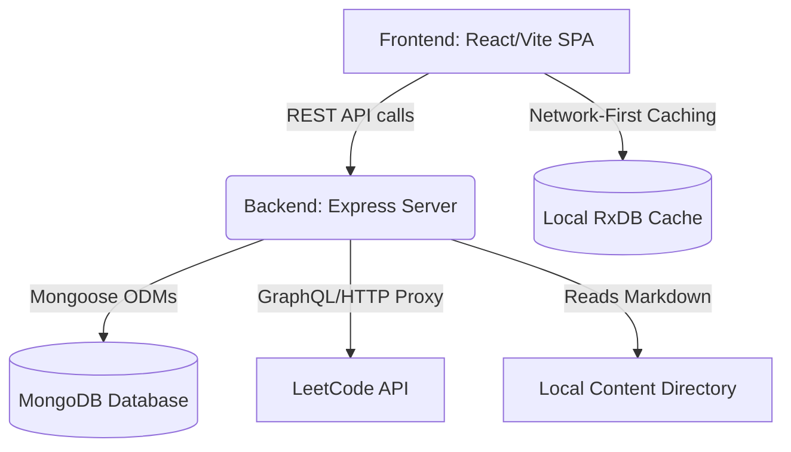

# Architecture Overview

The DSA Preparation project is a comprehensive web application designed to help users track and manage their Data Structures and Algorithms interview preparation. It automates problem tracking via LeetCode synchronization, suggests problems for revision, and provides interactive analytics.

## High-Level Architecture

The system follows a classic decoupled Client-Server architecture:
- **Frontend (Client):** A Single Page Application (SPA) built with React and Vite. It handles the user interface, client-side routing, and local data caching.
- **Backend (Server):** A Node.js and Express RESTful API that handles business logic, LeetCode data scraping, authentication, and database operations.
- **Database:** A MongoDB database (accessed via Mongoose) that stores user data, tracked problems, predefined learning tracks, and settings.

### Component Diagram

## Data Flow

1. **User Interaction & Caching:** 
   The user interacts with the React interface. For GET requests, the frontend utilizes an `apiFetch` wrapper built with `RxJS`. This implements a Network-First caching strategy—if the backend is unreachable, the frontend falls back to a local `RxDB` cache to serve offline data.
   
2. **Authentication Flow:**
   Users log in via Google OAuth (using `@react-oauth/google`). The frontend sends an authentication request to the backend `/api/auth` routes. The backend verifies the token and issues a custom JWT, which is then passed in the `Authorization` header for protected routes.

3. **LeetCode Auto-Sync:**
   When the user accesses the Tracker or triggers a sync:
   - The frontend calls `/api/sync/check` and `/api/sync/track`.
   - The backend uses `leetcodeScraperUtil.ts` to fetch recent submissions directly from LeetCode's GraphQL/Public APIs on behalf of the user's configured `leetcodeUsername`.
   - New and revisited problems are deduplicated and upserted into the MongoDB `TrackedProblem` collection.

4. **Learning Documents Parsing:**
   The `documentController` on the backend dynamically reads local Markdown files from the `content/theory` directory. It parses the frontmatter to extract metadata (title, tags) and serves the content to the frontend `Learn` tab.

5. **Smart Revisit Algorithm:**
   The backend provides the logic via the `trackerController` to surface problems the user hasn't attempted in a while or struggled with, pulling data directly from the MongoDB queries.

## Key Technologies

- **Frontend:** React 19, TypeScript, Vite, Tailwind CSS, Recharts (Analytics), RxDB / Dexie (Offline Caching), Framer Motion (Animations).
- **Backend:** Node.js, Express.js, TypeScript, Mongoose (MongoDB ORM), JWT (Auth), Google Auth Library.
- **Infrastructure:** Docker (`Dockerfile` and `Procfile` provided for deployment), MongoDB.
